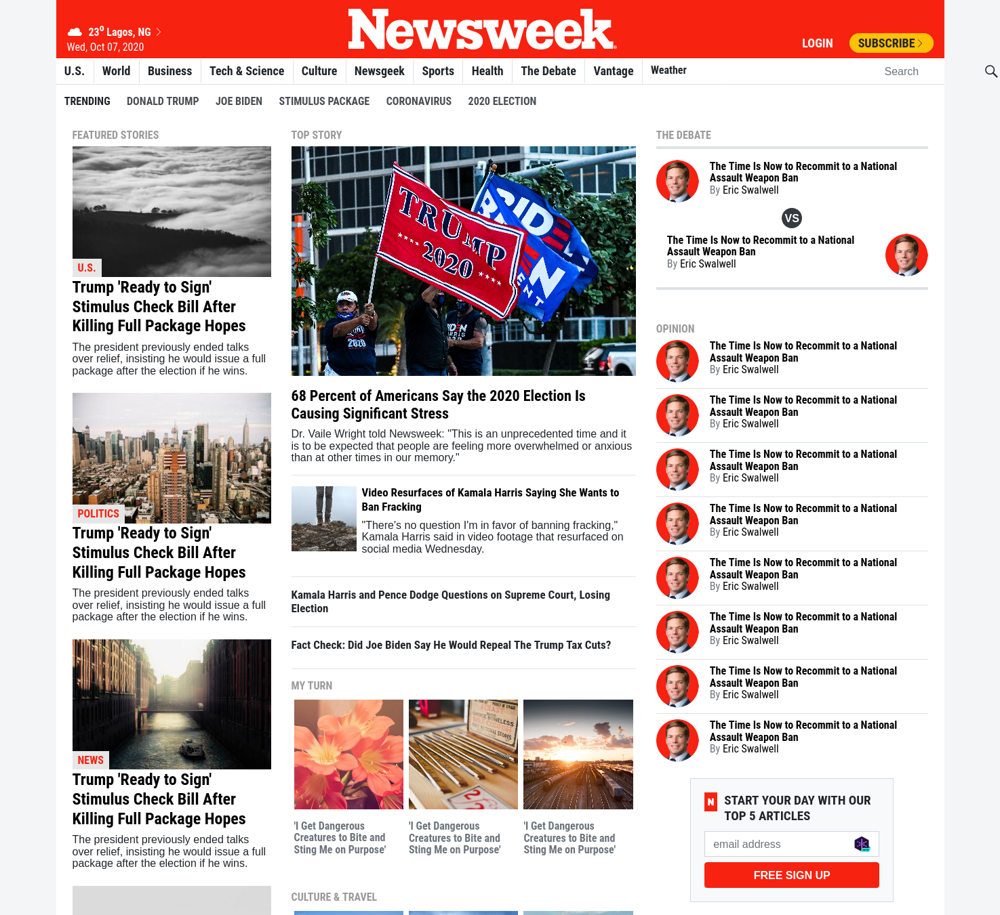

# The News Week Clone

> Replica of the news site The Newsweek.com webpage created with bootsrap framework.

This project is the 7th project in the HTML/CSS module at Microverse.

We tried to use Bootstrap classes wherever possible.

## Built With

- HTML5
- CSS3
- Bootsrap framework

## Live Demo

[Live Demo Link](https://sinansevgi.github.io/newsweek-clone/)

## Authors

👤 **CY Kalu**

- GitHub: [@cyonii ](https://github.com/cyonii )
- Twitter: [@theOnuoha](https://twitter.com/theOnuoha)
- LinkedIn: [@silas-kalu](https://www.linkedin.com/in/silas-kalu-2a9a13199/ )

👤 **Sinan Sevgi**

- GitHub: [@sinansevgi](https://github.com/sinansevgi)
- LinkedIn: [@sinansevgi](https://www.linkedin.com/in/sinan-s-52559437/)
- Twitter: [@nativeofcyber1](https://twitter.com/nativeofcyber1)

## 🤝 Contributing

Contributions, issues, and feature requests are welcome!
